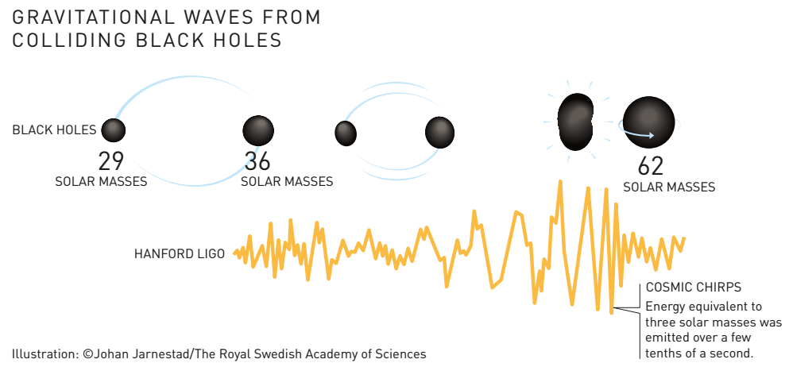

# 清华大学2017观测宇宙学课程 

## 课程基本信息 
- 任课教师：Houjun Mo  
坐标：蒙民伟科技大楼南楼（S615）  
个人主页：[UMass](http://people.umass.edu/~hjmo/), [清华](http://www.tsinghua.edu.cn/publish/phy/6032/2015/20151229082616908129944/20151229082616908129944_.html)  
邮箱：hjmo@umass.edu

- 助教： 陈洋遥（博士1年级）  
微信 15271804273  
邮箱 yangyao-17@mails.tsinghua.edu.cn  
坐标： 蒙民伟科技大楼南楼（S612，学生办公室）  
答疑/交流时间：每周一下午（S612，陈洋遥）；每周六下午（S612，王凯）；其他时间请提前告知。  
注：10月9日（周一）助教有事外出，这周答疑/交流时间改在10月10日（周二）下午。

- 课程微信群: 请联系助教加入。  
- 课程PPT讲义：请在信息门户[网络学堂](http://info.tsinghua.edu.cn/)内下载。每次课前会将PPT上传，请同学们做好预习。  
- 教材：  
[The Essential Cosmic Perspectives](https://www.amazon.com/The-Essential-Cosmic-Perspective-Edition/dp/0321928083), Bennett et al.  
[Discovering the Universe](https://www.amazon.com/Discovering-Universe-Neil-F-Comins/dp/1464140863/ref=sr_1_1?s=books&ie=UTF8&qid=1505828242&sr=1-1&keywords=discovering+the+universe), Comins et al.  
获取方式：土豪同学请自行购买，非土豪同学请.....（你懂的）。  

- 成绩评估：  
考勤10%（请假请提前联系助教）；  
作业30%（5次，每次6%）；  
课程Project（文字内容20%，展示与交流10%，Project内容请等待老师通知）；  
期末考试（30%，开卷）。  

## 课程作业  
### 第一次作业   
- 请未领到作业的同学自行[下载](./hm/hm1.pdf)，并使用A4纸打印出来；答案请用A4纸书写，与题目一起装订好了交上来。  
勘误：第9题，请将求经度（longitude）改成求纬度（latitude）。   
上交时间：10月10日上课后截止，迟交不收。  
成绩统计情况： 见[成绩统计界面](./stats/stats.md)。

 
### 第二次作业
- 请未领到作业的同学自行[下载](./hm/hm2.pdf)，并使用A4纸打印出来；答案请用A4纸书写，与题目一起装订好了交上来。  
上交时间：10月24日上课后截止，迟交不收。  
成绩统计情况： 见[成绩统计界面](./stats/stats.md)。
 

### 第三次作业  
- 请未领到作业的同学自行[下载](./hm/hm3.pdf)，并使用A4纸打印出来；答案请用A4纸书写，与题目一起装订好了交上来。  
上交时间：11月7日上课后截止，迟交不收。   
- 勘误：  
A5: 小题序号有重复  
A6：恒星的名称改为Struve 2398A.  
B4(2) Proxima Centauri离地球的距离d已知为4.25光年。  
B5 题干的速度 V = 86 km/s 改为 V = 86 m/s.  
B5题干最后一句改为：... and we can calculate the star's mass M, from its spectral type, where M = 1.1 solar mass. 

### 第四次作业  
- 请未领到作业的同学自行[下载](./hm/hm4.pdf)，并使用A4纸打印出来；答案请用A4纸书写，与题目一起装订好了交上来。  
上交时间：11月21日上课后截止，迟交不收。  
提示：有不会做的题目，请仔细阅读PPT或者教材。

### 课程论文  

- 课程论文要求见[《观测宇宙学-从太阳系走向宇宙深处课程论文要求》](./hm/thesis_requir.pdf)。

## 来自助教的福利   
###  如何找到漂亮的星空图片  

<table><tr>
<td></td>
<td></td>
</tr></table>

- 网站cosmotography上总有你喜欢的图片，比如这个三叶草[M20](http://www.cosmotography.com/images/small_ngc6514.html)，传说可以在考试之前膜拜以求平安。  
- NASA的网页。例如这个神奇的[创世之柱](https://www.nasa.gov/multimedia/imagegallery/image_feature_252.html)。  

### 如何从易到难，开始自己的天文研究之路  
- [SDSS education](http://skyserver.sdss.org/dr12/en/proj/basic/solarsystem/solarsystemhome.aspx)将一步一步教你如何走进天文学世界。  
- 来天体中心（坐标：蒙民伟科技大楼南楼S727）聆听大佬的学术报告。报告内容和时间请见[Calendar](http://astro.tsinghua.edu.cn/index.php/events/calendar)（其中绿色边框的为正式报告，欢迎同学们过来）。  
- 和老师交流，探讨自己感兴趣的方向，或者开始自己感兴趣的课题。天体中心老师的信息可见物理系[教职员工表](http://www.tsinghua.edu.cn/publish/phy/5314/index.html)-天体物理一栏。感兴趣的同学可以主动和老师联系。  
- 最重要的：好好学习基础课程，尤其是应该掌握一门编程语言，推荐[Python](https://www.python.org/)，自学可参考[一个简易的入门指南](https://www.liaoxuefeng.com/wiki/001374738125095c955c1e6d8bb493182103fac9270762a000/)。  

### 遇到问题怎么办  
- 无论是知识概念上的困难，或是技术上的疑惑，或是作业中的难题，都可与老师或助教交流。也可发在微信群里，大家一起讨论。 
- 认真阅读课件和教材。
- 多查找外文文献。

## 附录   
### 00. 如何夜观天象   
晴朗的夜晚，当你以45度角凝视天空，将会发现许多闪亮的星星。其中哪些是行星，哪些是恒星？它们都叫什么名字？试着使用手机星图软件[Stellarium](https://pan.baidu.com/s/1mhQ5c60)（转自[Stellarium吧](http://tieba.baidu.com/p/5109325762)），将手机对准天空，就可以看到这些星星的信息了！  
- 试着找到火星、土星和木星。它们是否比其他星星更亮？火星真的是红色的吗？  
- 星图上还会显示一些星系的名字，你能看到它们吗？  

### 01. The Universe   
#### 观察我们的宇宙  
- 推荐一个小视频[4分钟，从地球旅行到宇宙边缘](https://www.bilibili.com/video/av4433339/?from=search&seid=13726920308564500485)(感谢王凯童鞋的分享)。  
- [一个星系团的形成演化历史](http://www.illustris-project.org/movies/illustris_movie_rot_sub_frame.mp4)(来自Illustris模拟)，[大尺度的暗物质结构](http://www.illustris-project.org/movies/illustris_movie_dmdens_z0_slicing.mp4)。更多图片、视频可以在[Illustris主页](http://www.illustris-project.org/media/)上寻找(感谢王凯童鞋的分享)。  
#### 宇宙微波背景辐射  
[宇宙微波背景辐射](https://en.wikipedia.org/wiki/Cosmic_microwave_background)（CMB）是20世纪最重要的天文学发现之一，它可以让我们了解到宇宙极早期（自诞生约30万年，红移约1000）的丰富信息。对CMB的测量，不仅可以用来限制宇宙学模型，也是用来获得宇宙学参数的最佳方法。   [WMAP](https://map.gsfc.nasa.gov/)和[Planck](http://planck.cf.ac.uk/)是最重要的两个CMB测量工程，进入它们的网站，看看我们的宇宙由哪些组分构成。尝试回答下面的问题：  
- 组成我们人体的重子物质、看不见的暗物质、神秘的暗能量，它们在宇宙中各占据着多大的分量？
- 谁发现了CMB？是机缘巧合还是早有预见？
- 我们观测到的CMB，是来自于宇宙同一个时期产生的光子，还是来自于不同时期产生的光子？
- 相比于观测星光，为什么观测CMB能够获得宇宙更早期的信息？
- 为什么CMB的波长远比可见光波长要长？  
- 为什么[CMB在天空的分布](https://map.gsfc.nasa.gov/media/121238/index.html)不是均匀的？ 

#### 一些科普小视频  
- 斗转星移系列，例如[春天伊始](http://www.acfun.cn/v/ac3332225_12)和[迟到的春分点](http://www.acfun.cn/v/ac3332225_13)。 
- BBC Universe, such as '[what ia dark matter?](http://www.bbc.co.uk/science/space/universe/questions_and_ideas/dark_matter/)'.

### 02. 搞个大新闻

#### 2017诺贝尔物理学奖-引力波
- "for decisive contributions to the LIGO detector and the observation of [gravitational waves](https://github.com/ChenYangyao/THU2017ObservationalAstronomy/blob/master/GW.png)"  
 
- [引力波是什么？发现后有什么价值？](https://www.zhihu.com/question/40299051?sort=created)

#### 双中子星合并引力波源的首次探测  

- [GW170817](http://www.ligo.org/detections/GW170817.php) - The first observation of gravitational-waves from a binary neutron star.  

- [如何理解 LIGO 探测到的来自双中子星合并的引力波事件 GW170817？](https://www.zhihu.com/question/66618915/answer/245442603) 

#### 来自FAST的好消息  

- [FAST首批成果新闻发布会
](http://www.bao.ac.cn/xwzx/zyxw/201710/t20171010_4871382.html)

- [FAST 首次发现脉冲星，对 FAST 和中国天文学界有什么意义？](https://www.zhihu.com/question/66430136)

